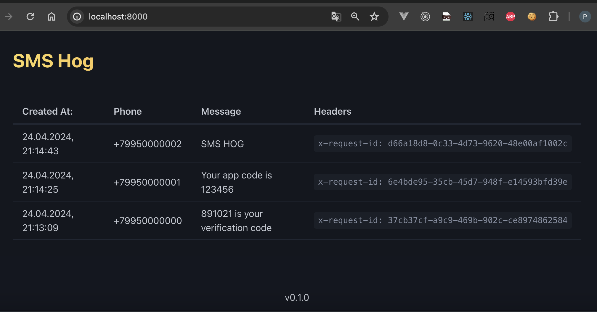

# SMS Hog
SMS Hog is a small mock service for sending SMS.  
It consists of a tiny FastAPI file and MongoDB.  
It also has a web interface displaying sent SMS messages.



## Usage
Start
```bash
docker-compose up -d
```

Stop
```bash
docker-compose down
```

## php api client
n the "example" folder, there is a sample PHP client.  
You can use it to send requests.  

```bash
docker-compose run -it --rm php php client.php "SMS HOG" "+79950000002"
```

## License
MIT
